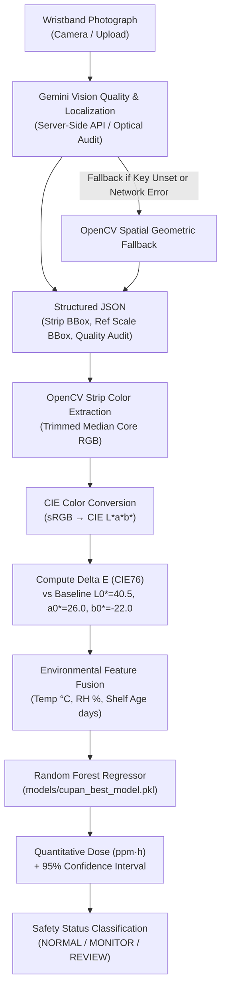

# Cu-PAN Wristband Image-Analysis Pipeline (Prototype)

This pipeline provides automated computer-vision color extraction and machine-learning exposure quantification for the **RageB8 Passive Colorimetric H₂S Dosimeter Wristband**.

> [!NOTE]
> **SIMULATED / PROTOTYPE READING**  
> All dose predictions and calibration data reflect prototype kinetics and literature-informed Cu-PAN dye chelation behavior (Thongboon et al. 2023 *ACS Omega*, Wang et al. 2022 *Sens. Actuators B*). This pipeline is for engineering demonstration and prototype validation.

---

## 1. Pipeline Architecture



> [!IMPORTANT]
> **Strict Separation of Duties & Security Policy**
> 1. **No Direct Exposure Prediction by Gemini**: Gemini Vision NEVER predicts ppm·h or H₂S exposure. It is strictly used for wristband presence detection, region localization, and optical quality verification (blur, darkness, glare, missing strip).
> 2. **Credential Isolation**: The Gemini API key remains strictly on the server/backend (`GEMINI_API_KEY`). It is never embedded in client apps or the Android frontend.
> 3. **Guaranteed Fallback**: If the Gemini API is unreachable, unconfigured, or fails, the pipeline automatically falls back to OpenCV spatial contour localization without interrupting measurement.


---

## 2. Prerequisites & Setup

The pipeline uses standard Python libraries (`opencv-python` and `numpy`).

Verify your environment:
```powershell
python -c "import cv2, numpy; print('OpenCV:', cv2.__version__, '| NumPy:', numpy.__version__)"
```

---

## 3. Quick Start & Test Commands

### Step A: Generate Synthetic Test Images
Generate realistic test wristband photos representing baseline safe, low monitor, high review, and expired bands:
```powershell
python scripts/generate_test_wristbands.py
```
This generates 4 sample PNGs in `test_images/`:
- `wristband_baseline_safe.png` (Unexposed deep purple, ~0.00–0.35 ppm·h)
- `wristband_low_monitor.png` (Intermediate pink, ~0.91 ppm·h)
- `wristband_high_review.png` (Yellow-orange, ~18.8 ppm·h)
- `wristband_expired_band.png` (90+ day shelf-life flag)

---

### Step B: Run Image Analysis

#### 1. Analyze a Safe Wristband (Expected: NORMAL)
```powershell
python scripts/analyze_wristband.py test_images/wristband_baseline_safe.png --save-annotated test_images/out_baseline.png
```

#### 2. Analyze an Intermediate Action Band (Expected: MONITOR)
```powershell
python scripts/analyze_wristband.py test_images/wristband_low_monitor.png --save-annotated test_images/out_monitor.png
```

#### 3. Analyze a High Exposure Band (Expected: REVIEW)
```powershell
python scripts/analyze_wristband.py test_images/wristband_high_review.png --save-annotated test_images/out_review.png
```

#### 4. Custom Environmental Parameters (Temperature, Humidity, Shelf Age)
If environmental telemetry is available from ambient sensors or manual entry, pass them directly via CLI:
```powershell
python scripts/analyze_wristband.py test_images/wristband_low_monitor.png --temp 32.5 --humidity 65.0 --shelf-age 30.0
```

#### 5. Analyze an Expired Wristband (Shelf Age > 90 Days)
```powershell
python scripts/analyze_wristband.py test_images/wristband_expired_band.png --shelf-age 105.0
```

#### 6. Export as JSON (for Mobile App / Backend Integration)
```powershell
python scripts/analyze_wristband.py test_images/wristband_low_monitor.png --json
```

#### 7. Manual Region of Interest (ROI Override)
If analyzing a non-standard photo or cropped closeup, specify the strip bounding box `x,y,w,h`:
```powershell
python scripts/analyze_wristband.py test_images/wristband_low_monitor.png --roi 340,160,120,160
```

---

## 4. Sample CLI Output

```text
=================================================================
      *** SIMULATED / PROTOTYPE READING ***
  RageB8 Passive Colorimetric H2S Dosimeter Pipeline
=================================================================
Target Image:      wristband_low_monitor.png
Sensing Chemistry: Cu-PAN Chelation Dye (Porous Matrix)
-----------------------------------------------------------------
1. EXTRACTED COLOR METRICS
   • Extracted RGB:     (177, 86, 107) [Hex: #B1566B]
   • CIE L*a*b*:        L*=48.34, a*=39.19, b*=5.55
   • Color Diff (ΔE):   31.53 (vs baseline unexposed Cu-PAN)
-----------------------------------------------------------------
2. ENVIRONMENTAL PARAMETERS
   • Temperature:       25.0 °C
   • Relative Humidity: 50.0 %
   • Band Shelf Age:    15.0 days (ACTIVE)
-----------------------------------------------------------------
3. MACHINE LEARNING QUANTITATIVE INFERENCE
   • Estimated Dose:    0.91 ppm·h
   • 95% Confidence CI: ±0.32 ppm·h  [0.59 – 1.23 ppm·h]
   • Inference Model:   Random Forest Regressor (60 estimators)
-----------------------------------------------------------------
4. SAFETY CLASSIFICATION:  >> MONITOR <<
   • Action Directive:   Action level reached (0.50–1.00 ppm·h). Limit further exposure & inspect ventilation.
=================================================================
[Saved annotated verification image to: test_images/out_monitor.png]
```

---

## 5. Threshold Standards & Classification Logic

| Exposure Range (ppm·h) | Status Flag | Operational Decision & Action |
| :--- | :--- | :--- |
| **< 0.50 ppm·h** | `NORMAL` | Normal operations; within standard 8-hr OSHA/NIOSH permissible limit. |
| **0.50 – 1.00 ppm·h** | `MONITOR` | Action level reached; inspect local scrubbers/ventilation and rotate personnel. |
| **> 1.00 ppm·h** | `REVIEW` | Threshold exceeded; immediate evacuation, respiratory assessment, medical triage. |
| **Shelf Age > 90 d** | `EXPIRED / REJECT` | Band matrix degradation; physical strip expired, reading invalidated. |

---

## 6. Files in this Module

- `scripts/analyze_wristband.py`: Main CLI OpenCV + ML analysis tool.
- `scripts/generate_test_wristbands.py`: Synthetic dosimeter image generator for pipeline validation.
- `models/cupan_best_model.pkl`: Trained Random Forest Regressor (60 decision trees).
- `models/cupan_model.py`: Model inference class definitions and custom pickle deserializer.
- `models/cupan_model_metadata.json`: Feature specifications and benchmark metrics.
- `test_images/`: Synthetic sample images and annotated debug outputs.
